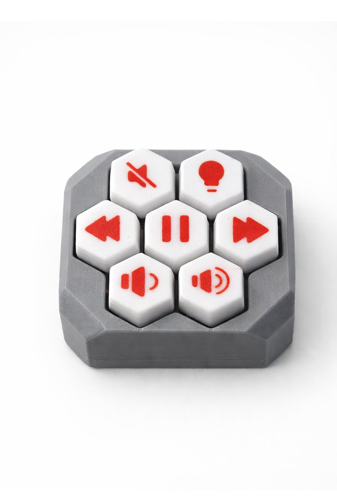
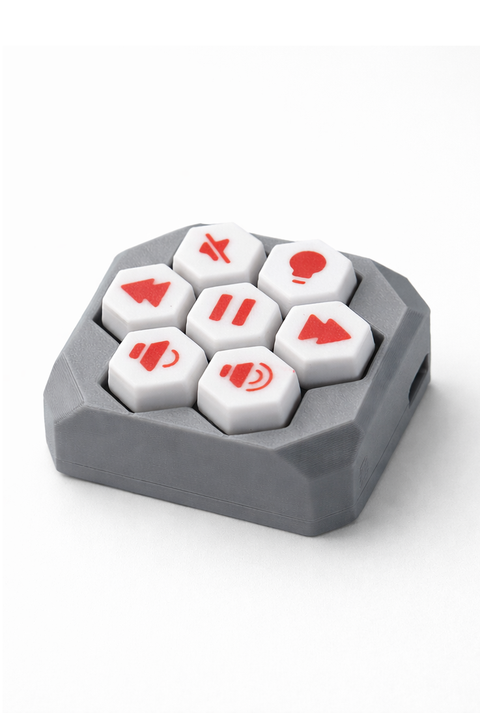

<h1 align="center">DreamDeck 🎛️</h1>

  A custom-built macro controller combining <b>Python</b>, <b>embedded hardware</b> and a clean, minimal design.

  
  &nbsp;&nbsp;&nbsp;
  

---

## 🧠 Overview

**DreamDeck** is a DIY macro controller inspired by commercial stream decks.  
It focuses on **hardware–software integration**, simplicity, and extensibility.

The project combines:
- 🐍 Python-based control logic
- 🔌 Custom hardware input (physical buttons)
- 🧩 Modular design for easy expansion

---

## ✨ Features

- 🔘 Physical macro buttons
- ⚡ Fast input handling
- 🧠 Python-based action mapping
- 🔧 Designed for customization & hacking
- 🖨️ 3D-printed enclosure

---

## 🛠 Tech Stack

**Software**
- Python
- USB / HID communication
- Modular action handling

**Hardware**
- Custom button layout
- Microcontroller-based input
- 3D printed case & keycaps

---

## 📸 Hardware

The current prototype features a compact hex-style button layout  
with custom keycaps and a minimal enclosure.

  

---

## 🚀 Roadmap

- [ ] Configurable profiles
- [ ] Web-based configuration UI
- [ ] Macro layers
- [ ] Improved firmware abstraction

---

## 📬 Contributing & Feedback

Ideas, issues, and pull requests are welcome.  
This project is built to learn, improve, and experiment.

---

  <i>Built to explore the intersection of hardware & software.</i>

